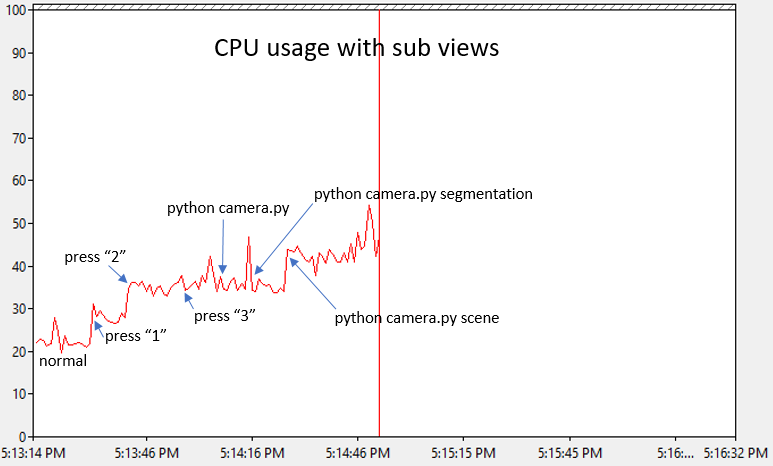

# Camera Views

The camera views that are shown on screen are the camera views you can fetch via the [simGetImages API](image_apis.md).


From left to right is the depth view, segmentation view and the FPV view. See [Image APIs](image_apis.md) for description of various available views.

## Turning ON/OFF Views

Press F1 key to see keyboard shortcuts for turning on/off any or all views. You can also select various view modes there, such as "Fly with Me" mode, FPV mode and "Ground View" mode.

## Configuring Sub-Windows

Now you can select what is shown by each of above sub windows. For instance, you can chose to show surface normals in first window (instead of depth) and disparity in second window (instead of segmentation). Below is the settings value you can use in [settings.json](settings.md):

```
{
  "SubWindows": [
	{"Index": 1, "ImageType": 5},
	{"Index": 2, "ImageType": 3}
  ]
}
```

## Performance Impact

*Note*: This section is outdated and has not been updated for new performance enhancement changes.

Now rendering these views does impact the FPS performance of the game, since this is additional work for the GPU.  The following shows the impact on FPS when you open these views.


This is measured on Intel core i7 computer with 32 gb RAM and a GeForce GTX 1080
graphics card running the Modular Neighborhood map, using cooked debug bits, no debugger or GameEditor open.  The normal state with no subviews open is measuring around 16 ms per frame, which means it is keeping a nice steady 60 FPS (which is the target FPS).  As it climbs up to 35ms the FPS drops to around 28 frames per second, spiking to 40ms means a few drops to 25 fps.

The simulator can still function and fly correctly when all this is going on even in the worse case because the physics is decoupled from the rendering.  However if the delay gets too high such that the communication with PX4 hardware is interrupted due to overly busy CPU then the flight can stall due to timeout in the offboard control messages.

On the computer where this was measured the drone could fly the path.py program
without any problems with all views open, and with 3 python scripts running 
to capture each view type.  But there was one stall during this flight, but it
recovered gracefully and completed the path.  So it was right on the limit.

The following shows the impact on CPU, perhaps a bit surprisingly, the CPU impact is also non trivial.


